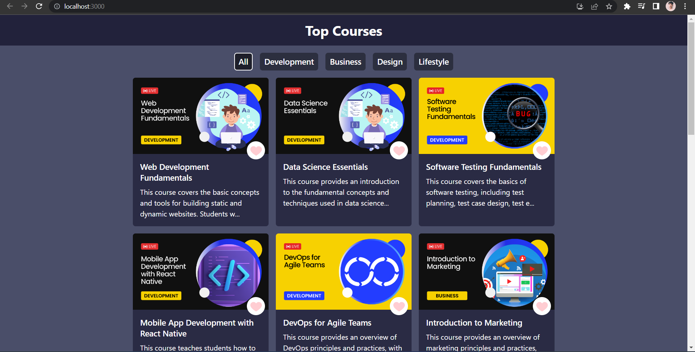

# Top Course Website

Welcome to the Top Course Website! This project is a web application built with ReactJS to showcase and recommend top courses in various domains.

## Features

- Browse and search for top courses in different categories.
- View detailed course information, including title & description.
- Sort courses based on different catagories Development, Business,   Design & Lifestyle.
- Like courses as favorites or dislike.
- Interactive user interface for an enhanced browsing experience.

## Demo Video

## Installation

To run the project locally, follow these steps:

1. Clone the repository: `git clone https://github.com/ramgpal/TopCourseWebsite.git`
2. Navigate to the project directory: `cd top-course-website`
3. Install the dependencies: `npm install`
4. Install the react-icons: `npm install react-icons`
5. Intall the react-toastify: `npm i react-toastify`
4. Start the development server: `npm start`
5. Open your browser and visit `http://localhost:3000` to access the website.

## Contributing

Contributions are welcome! If you'd like to contribute to this project, please follow these steps:

1. Fork the repository.
2. Create a new branch: `git checkout -b feature/your-feature`
3. Make your changes and commit them: `git commit -m 'Add some feature'`
4. Push to the branch: `git push origin feature/your-feature`
5. Submit a pull request detailing your changes.

Please ensure that your code follows the project's coding conventions and that you have thoroughly tested your changes.
